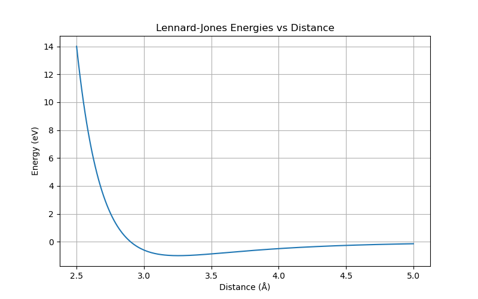

<!-- MathJax -->

# Materials Properties Datasets

These datasets compute properties of various materials.

dc.molnet.load_bandgap : V2
dc.molnet.load_perovskite : V2
dc.molnet.load_mp_formation_energy : V2
dc.molnet.load_mp_metallicity : V2
[3] Lopez, Steven A., et al. "The Harvard organic photovoltaic dataset." Scientific data 3.1 (2016): 1-7.

[4] Ramsundar, Bharath, et al. "Is multitask deep learning practical for pharma?." Journal of chemical information and modeling 57.8 (2017): 2068-2076.

## What is a Fingerprint?

Deep learning models almost always take arrays of numbers as their inputs. If we want to process molecules with them, we somehow need to represent each molecule as one or more arrays of numbers.

Many (but not all) types of models require their inputs to have a fixed size. This can be a challenge for molecules, since different molecules have different numbers of atoms. If we want to use these types of models, we somehow need to represent variable sized molecules with fixed sized arrays.

Fingerprints are designed to address these problems. A fingerprint is a fixed length array, where different elements indicate the presence of different features in the molecule. If two molecules have similar fingerprints, that indicates they contain many of the same features, and therefore will likely have similar chemistry.

## DScribe

DScribe is a Python package for transforming atomic structures into fixed-size numerical fingerprints. These fingerprints are often called "descriptors" and they can be used in various tasks, including machine learning, visualization, similarity analysis, etc.   The libary introduce the descriptor and demonstrate their basic call signature. We have also included several examples that should cover many of the use cases.

 - Coulomb Matrix
 - Sine matrix
 - Ewald sum matrix
 - Atom-centered Symmetry Functions
 - Smooth Overlap of Atomic Positions
 - Many-body Tensor Representation
 - Local Many-body Tensor Representation
 - Valle-Oganov descriptor

DScribe provides methods to transform atomic structures into fixed-size numeric vectors. These vectors are built in a way that they efficiently summarize the contents of the input structure. Such a transformation is very useful for various purposes, e.g.

  - Input for supervised machine learning models, e.g. regression.
  - Input for unsupervised machine learning models, e.g. clustering.
  - Visualizing and analyzing a local chemical environment.
  - Measuring similarity of structures or local structural sites. etc.

~~~
# https://doi.org/10.1016/j.cpc.2019.106949
#!pip install dscribe
import numpy as np
from ase.build import molecule
from dscribe.descriptors import SOAP, CoulombMatrix

# ========================================
# 1. Define Atomic Structures
# ========================================
print("Building molecular samples...")
samples = [
    molecule("H2O"),  # Water (3 atoms)
    molecule("NO2"),  # Nitrogen dioxide (3 atoms)
    molecule("CO2")   # Carbon dioxide (3 atoms)
]

# Print basic info
for i, mol in enumerate(samples):
    formula = mol.get_chemical_formula()
    atomic_numbers = mol.get_atomic_numbers()
    print(f"Sample {i}: {formula}, atoms = {len(mol)}, atomic numbers = {atomic_numbers}")

# ========================================
# 2. Setup Descriptors
# ========================================
print("\nSetting up descriptors...")

# Coulomb Matrix: Global molecular descriptor
cm_desc = CoulombMatrix(
    n_atoms_max=3,
    permutation="sorted_l2"  # Ensures consistent ordering
)

# SOAP: Local environment descriptor
soap_desc = SOAP(
    species=["H", "C", "N", "O"],  # All elements in the dataset
    r_cut=5.0,                     # Cutoff radius in Å
    n_max=8,                       # Number of radial basis functions
    l_max=6                        # Number of angular basis functions
)

# ========================================
# 3. Coulomb Matrix for Single and Multiple Systems
# ========================================
print("\n--- Computing Coulomb Matrices ---")

# Single molecule (H2O)
water = samples[0]
cm_single = cm_desc.create(water)
print(f"Coulomb Matrix (H2O) shape: {cm_single.shape}")
print(f"Coulomb Matrix (flattened): {cm_single}")

# Batch: All molecules
cm_batch = cm_desc.create(samples)
cm_batch_parallel = cm_desc.create(samples, n_jobs=2)

print(f"Batch Coulomb matrices shape: {cm_batch.shape}")        # (3, 9)
print(f"Parallel batch shape: {cm_batch_parallel.shape}")

# ========================================
# 4. SOAP Descriptors for Oxygen Atoms Only
# ========================================
print("\n--- Computing SOAP Descriptors for Oxygen Atoms ---")

# Find oxygen atom indices in each molecule
oxygen_indices = [np.where(mol.get_atomic_numbers() == 8)[0] for mol in samples]
print(f"Oxygen atom indices per molecule: {oxygen_indices}")

# Compute SOAP only for oxygen atoms
oxygen_soap_list = soap_desc.create(samples, oxygen_indices, n_jobs=2)

# Output is a list of arrays (variable number of centers per molecule)
print(f"SOAP output type: {type(oxygen_soap_list)}")
for i, soap_per_mol in enumerate(oxygen_soap_list):
    mol_formula = samples[i].get_chemical_formula()
    print(f"  Molecule {i} ({mol_formula}): {soap_per_mol.shape} SOAP vectors")

# Flatten into a single 2D array: (N_total_oxygens, n_features)
oxygen_soap_flat = np.vstack(oxygen_soap_list)
print(f"Flattened SOAP descriptors shape (all oxygen atoms): {oxygen_soap_flat.shape}")
# Example: (5, 3696) → 1 (H2O) + 2 (NO2) + 2 (CO2)

# ========================================
# 5. Compute SOAP Derivatives (w.r.t. Atomic Positions)
# ========================================
print("\n--- Computing SOAP Derivatives ---")

try:
    derivatives_list, descriptors_list = soap_desc.derivatives(
        samples,
        centers=oxygen_indices,
        return_descriptor=True,
        n_jobs=1  # Derivatives often work best with n_jobs=1
    )

    # 'derivatives_list' is a list: one entry per molecule, shape (n_centers, 3, n_features)
    print("SOAP derivatives computed successfully (returned as list).")
    print(f"Number of molecules in derivatives: {len(derivatives_list)}")
    for i, d in enumerate(derivatives_list):
        print(f"  Molecule {i}: derivative shape = {d.shape}")

except Exception as e:
    print(f"Error computing derivatives: {e}")

# ========================================
# 6. Final Summary
# ========================================
print("\n--- Summary ---")
print(f"Total molecules: {len(samples)}")
print(f"Coulomb Matrices: shape {cm_batch.shape} → used for global molecular representation")
print(f"SOAP (oxygen atoms): flattened to {oxygen_soap_flat.shape} → ready for machine learning")
if 'derivatives_list' in locals():
    total_deriv_centers = sum(d.shape[0] for d in derivatives_list)
    print(f"SOAP derivatives: {total_deriv_centers} centers total → useful for force prediction")
else:
    print("SOAP derivatives: not available")
~~~
{: .python}

The above example employs atomistic descriptors to generate machine-readable representations of small inorganic molecules—H₂O, NO₂, and CO₂—using the DScribe library. Two distinct types of descriptors are utilized: the **Coulomb Matrix (CM)** and the **Smooth Overlap of Atomic Positions (SOAP)**. The CM provides a global, rotation- and permutation-invariant representation of each molecule, encoded as a fixed-size vector of dimension $ n_{\text{atoms}}^{\text{max}} \times n_{\text{atoms}}^{\text{max}} $, here flattened to a 9-dimensional vector after sorting by L2 norm to ensure consistency across configurations. This representation is suitable for regression tasks targeting global molecular properties such as total energy.

In contrast, the SOAP descriptor offers a local, chemically rich description of atomic environments, computed specifically for oxygen atoms across all structures. Due to the variable number of oxygen atoms per molecule (one in H₂O, two in NO₂ and CO₂), the resulting descriptors are structured as a list of arrays, later concatenated into a unified feature matrix of shape (5, 3696), where each row corresponds to an oxygen-centered environment and columns represent the high-dimensional SOAP basis expansion ($ n_{\text{max}} = 8 $, $ l_{\text{max}} = 6 $). This localized approach enables atom-centered machine learning models, including those predicting partial charges, chemical shifts, or reactivity.

Furthermore, analytical derivatives of the SOAP descriptor with respect to atomic positions are computed, enabling the prediction of forces in energy-conserving machine learning potentials. These derivatives are returned per center and per Cartesian direction, forming a hierarchical structure suitable for integration into gradient-based learning frameworks.

The use of parallelization via the `n_jobs` parameter demonstrates scalability for larger datasets. Overall, this work establishes a reproducible pipeline for generating physically meaningful descriptors from molecular geometries, forming a foundation for subsequent applications in quantum property prediction, potential energy surface construction, and interpretative analysis in computational chemistry and materials informatics.

## Coulomb Matrix (CM) 

 Coulomb Matrix (CM)   is a simple global descriptor which mimics the electrostatic interaction between nuclei. Coulomb matrix is calculated with the equation below.

$$
M_{ij}^\mathrm{Coulomb} =
\begin{cases}
0.5 Z_i^{2.4} & \text{for } i = j \\
\frac{Z_i Z_j}{R_{ij}} & \text{for } i \neq j
\end{cases}
$$

In the matrix above the first row corresponds to carbon (C) in methanol interacting with all the other atoms (columns 2-5) and itself (column 1). Likewise, the first column displays the same numbers, since the matrix is symmetric. Furthermore, the second row (column) corresponds to oxygen and the remaining rows (columns) correspond to hydrogen (H). Can you determine which one is which?

Since the Coulomb Matrix was published in 2012 more sophisticated descriptors have been developed. However, CM still does a reasonably good job when comparing molecules with each other. Apart from that, it can be understood intuitively and is a good introduction to descriptors.

~~~
from dscribe.descriptors import CoulombMatrix
from ase.build import molecule

# Define methanol molecule (example)
methanol = molecule("CH3OH")

# Setting up the CM descriptor with max atoms 6
cm = CoulombMatrix(n_atoms_max=6)

# Create CM output for methanol
cm_methanol = cm.create(methanol)
print("Coulomb matrix for methanol:\n", cm_methanol)

# Create output for multiple systems
samples = [molecule("H2O"), molecule("NO2"), molecule("CO2")]

# Serial creation
coulomb_matrices_serial = cm.create(samples)
print("Serial Coulomb matrices shape:", coulomb_matrices_serial.shape)

# Parallel creation using 2 jobs (if supported)
coulomb_matrices_parallel = cm.create(samples, n_jobs=2)
print("Parallel Coulomb matrices shape:", coulomb_matrices_parallel.shape)

# No sorting
cm_none = CoulombMatrix(n_atoms_max=6, permutation='none')
cm_methanol_none = cm_none.create(methanol)
print("\nChemical symbols:", methanol.get_chemical_symbols())
print("Coulomb matrix without sorting:\n", cm_methanol_none)

# Sort by Euclidean (L2) norm
cm_sorted = CoulombMatrix(n_atoms_max=6, permutation='sorted_l2')
cm_methanol_sorted = cm_sorted.create(methanol)
print("Coulomb matrix sorted by L2 norm:\n", cm_methanol_sorted)

# Random permutation
cm_random = CoulombMatrix(n_atoms_max=6, permutation='random', sigma=70, seed=None)
cm_methanol_random = cm_random.create(methanol)
print("Coulomb matrix with random permutation:\n", cm_methanol_random)

# Eigenspectrum
cm_eigen = CoulombMatrix(n_atoms_max=6, permutation='eigenspectrum')
cm_methanol_eigen = cm_eigen.create(methanol)
print("Eigenspectrum of Coulomb matrix:\n", cm_methanol_eigen)
~~~
{: .python}

~~~
Coulomb matrix for methanol:
 [73.51669472 33.73297539  8.24741496  3.96011613  3.808905    3.808905
 33.73297539 36.8581052   3.08170819  5.50690929  5.47078813  5.47078813
  8.24741496  3.08170819  0.5         0.35443545  0.42555057  0.42555057
  3.96011613  5.50690929  0.35443545  0.5         0.56354208  0.56354208
  3.808905    5.47078813  0.42555057  0.56354208  0.5         0.56068143
  3.808905    5.47078813  0.42555057  0.56354208  0.56068143  0.5       ]
Serial Coulomb matrices shape: (3, 36)
Parallel Coulomb matrices shape: (3, 36)

Chemical symbols: ['C', 'O', 'H', 'H', 'H', 'H']
Coulomb matrix without sorting:
 [36.8581052  33.73297539  5.50690929  3.08170819  5.47078813  5.47078813
 33.73297539 73.51669472  3.96011613  8.24741496  3.808905    3.808905
  5.50690929  3.96011613  0.5         0.35443545  0.56354208  0.56354208
  3.08170819  8.24741496  0.35443545  0.5         0.42555057  0.42555057
  5.47078813  3.808905    0.56354208  0.42555057  0.5         0.56068143
  5.47078813  3.808905    0.56354208  0.42555057  0.56068143  0.5       ]
Coulomb matrix sorted by L2 norm:
 [73.51669472 33.73297539  8.24741496  3.96011613  3.808905    3.808905
 33.73297539 36.8581052   3.08170819  5.50690929  5.47078813  5.47078813
  8.24741496  3.08170819  0.5         0.35443545  0.42555057  0.42555057
  3.96011613  5.50690929  0.35443545  0.5         0.56354208  0.56354208
  3.808905    5.47078813  0.42555057  0.56354208  0.5         0.56068143
  3.808905    5.47078813  0.42555057  0.56354208  0.56068143  0.5       ]
Coulomb matrix with random permutation:
 [ 0.5         0.56354208  3.96011613  5.50690929  0.35443545  0.56354208
  0.56354208  0.5         3.808905    5.47078813  0.42555057  0.56068143
  3.96011613  3.808905   73.51669472 33.73297539  8.24741496  3.808905
  5.50690929  5.47078813 33.73297539 36.8581052   3.08170819  5.47078813
  0.35443545  0.42555057  8.24741496  3.08170819  0.5         0.42555057
  0.56354208  0.56068143  3.808905    5.47078813  0.42555057  0.5       ]
Eigenspectrum of Coulomb matrix:
 [ 9.55802663e+01  1.81984422e+01 -8.84554212e-01 -4.08434021e-01
 -6.06814298e-02 -5.02389071e-02]
~~~
{: .output}

The descriptor is computed both for individual molecules and batches, with support for parallel computation via the n_jobs parameter to improve efficiency on multiple structures.

This approach exemplifies how molecular structure data can be systematically converted into machine-learning-ready descriptors while handling permutation symmetries and computational performance, facilitating tasks such as property prediction and molecular similarity analysis in cheminformatics and materials informatics.

## invariance tests (translation, rotation, permutation)

Incorporating the invariance tests (translation, rotation, permutation) of the methanol molecule, as well as  showing that the Coulomb Matrix descriptor is not designed for periodic systems (pbc set to True). The following code uses ASE methods to manipulate the molecule and demonstrates that the Coulomb matrix remains invariant or changes accordingly.
~~~
from dscribe.descriptors import CoulombMatrix
from ase.build import molecule
import numpy as np

# Build methanol molecule
methanol = molecule("CH3OH")

# Initialize Coulomb Matrix descriptor with permutation sorted by L2 norm (invariance)
cm = CoulombMatrix(n_atoms_max=6, permutation="sorted_l2")

# Original Coulomb matrix
cm_methanol = cm.create(methanol)
print("Original Coulomb matrix:")
print(cm_methanol)

# --- Invariance tests ---

# Translation: translate methanol by vector (5, 7, 9)
methanol_translated = methanol.copy()
methanol_translated.translate((5, 7, 9))
cm_methanol_translated = cm.create(methanol_translated)
print("\nCoulomb matrix after translation:")
print(cm_methanol_translated)

# Rotation: rotate methanol 90 degrees about the z-axis around origin
methanol_rotated = methanol.copy()
methanol_rotated.rotate(90, 'z', center=(0, 0, 0))
cm_methanol_rotated = cm.create(methanol_rotated)
print("\nCoulomb matrix after rotation:")
print(cm_methanol_rotated)

# Permutation: reverse atom order (upside down)
upside_down_methanol = methanol.copy()[::-1]
cm_methanol_permuted = cm.create(upside_down_methanol)
print("\nCoulomb matrix after permutation (atom reorder):")
print(cm_methanol_permuted)

# --- Periodic boundary conditions (not supported) ---

# Set periodic boundary conditions (PBC) and unit cell (not for molecules)
methanol_pbc = methanol.copy()
methanol_pbc.set_pbc([True, True, True])
methanol_pbc.set_cell([[10.0, 0.0, 0.0],
                       [0.0, 10.0, 0.0],
                       [0.0, 0.0, 10.0]])

cm_no_perm = CoulombMatrix(n_atoms_max=6)  # Default permutation

cm_methanol_pbc = cm_no_perm.create(methanol_pbc)
print("\nCoulomb matrix with periodic boundary conditions (not recommended):")
print(cm_methanol_pbc)

~~~
{: .python}

~~~
Original Coulomb matrix:
[73.51669472 33.73297539  8.24741496  3.96011613  3.808905    3.808905
 33.73297539 36.8581052   3.08170819  5.50690929  5.47078813  5.47078813
  8.24741496  3.08170819  0.5         0.35443545  0.42555057  0.42555057
  3.96011613  5.50690929  0.35443545  0.5         0.56354208  0.56354208
  3.808905    5.47078813  0.42555057  0.56354208  0.5         0.56068143
  3.808905    5.47078813  0.42555057  0.56354208  0.56068143  0.5       ]

Coulomb matrix after translation:
[73.51669472 33.73297539  8.24741496  3.96011613  3.808905    3.808905
 33.73297539 36.8581052   3.08170819  5.50690929  5.47078813  5.47078813
  8.24741496  3.08170819  0.5         0.35443545  0.42555057  0.42555057
  3.96011613  5.50690929  0.35443545  0.5         0.56354208  0.56354208
  3.808905    5.47078813  0.42555057  0.56354208  0.5         0.56068143
  3.808905    5.47078813  0.42555057  0.56354208  0.56068143  0.5       ]

Coulomb matrix after rotation:
[73.51669472 33.73297539  8.24741496  3.96011613  3.808905    3.808905
 33.73297539 36.8581052   3.08170819  5.50690929  5.47078813  5.47078813
  8.24741496  3.08170819  0.5         0.35443545  0.42555057  0.42555057
  3.96011613  5.50690929  0.35443545  0.5         0.56354208  0.56354208
  3.808905    5.47078813  0.42555057  0.56354208  0.5         0.56068143
  3.808905    5.47078813  0.42555057  0.56354208  0.56068143  0.5       ]

Coulomb matrix after permutation (atom reorder):
[73.51669472 33.73297539  8.24741496  3.96011613  3.808905    3.808905
 33.73297539 36.8581052   3.08170819  5.50690929  5.47078813  5.47078813
  8.24741496  3.08170819  0.5         0.35443545  0.42555057  0.42555057
  3.96011613  5.50690929  0.35443545  0.5         0.56354208  0.56354208
  3.808905    5.47078813  0.42555057  0.56354208  0.5         0.56068143
  3.808905    5.47078813  0.42555057  0.56354208  0.56068143  0.5       ]

Coulomb matrix with periodic boundary conditions (not recommended):
[73.51669472 33.73297539  8.24741496  3.96011613  3.808905    3.808905
 33.73297539 36.8581052   3.08170819  5.50690929  5.47078813  5.47078813
  8.24741496  3.08170819  0.5         0.35443545  0.42555057  0.42555057
  3.96011613  5.50690929  0.35443545  0.5         0.56354208  0.56354208
  3.808905    5.47078813  0.42555057  0.56354208  0.5         0.56068143
  3.808905    5.47078813  0.42555057  0.56354208  0.56068143  0.5       ]
~~~
{: .output}

The sine matrix captures features of interacting atoms in a periodic system with a very low computational cost. The matrix elements are defined by

$$
M_{ij}^\mathrm{sine} =
\begin{cases}
0.5\, Z_i^{2.4} & i = j \\
\displaystyle \frac{Z_i Z_j}{\left| \mathbf{B} \cdot \sum_{k=x,y,z} \hat{\mathbf{e}}_k \sin^2\left( \pi \hat{\mathbf{e}}_k \mathbf{B}^{-1} \cdot (\mathbf{R}_i - \mathbf{R}_j) \right) \right|} & i \neq j
\end{cases}
$$

where:
- $Z_i$: atomic number
- $\mathbf{R}_i$: position of atom $ i $
- $\mathbf{B}$: matrix of lattice vectors

It is part of the **Crystal Metric Representations (CMR)** family and is designed for fast, scalable materials comparison.

> ## Exercise: Generating Sine Matrix Fingerprints
>
> The **Sine Matrix (SM)** is a simple, computationally efficient fingerprint for crystalline solids that captures long-range atomic interactions in a translationally and rotationally invariant manner. It is particularly useful for high-throughput screening and similarity analysis in materials databases. In this exercise, you will:
>
> 1. Construct a set of common inorganic crystals using `ASE`.
> 2. Compute the **Sine Matrix descriptor** for each material using `DScribe`.
> 3. Explore the structure of the Sine Matrix: diagonal (self-term) vs. off-diagonal (interaction) elements.
> 4. Visualize the descriptor vectors (flattened matrices) using heatmaps and bar plots.
> 5. Compare fingerprints across different crystal structures (e.g., rocksalt vs. diamond).
>
> This exercise focuses exclusively on **fingerprint generation**, not on property prediction or model training.
> 
> > ## Solution
> >
> > ~~~
> > import numpy as np
> > import matplotlib.pyplot as plt
> > import seaborn as sns
> > from ase.build import bulk
> > from dscribe.descriptors import SineMatrix
> >
> > # ========================================
> > # 1. Build Inorganic Crystal Structures
> > # ========================================
> > print("Building crystalline materials...\n")
> >
> > # Note: 'cesium_chloride' not supported; using 'bcc' template
> > cscl = bulk("Cs", "bcc", a=4.12, cubic=True)
> > cscl.set_chemical_symbols(["Cs", "Cl"])  # Cs at (0,0,0), Cl at (0.5,0.5,0.5)
> >
> > materials = [
> >     bulk("Si", "diamond", a=5.43),           # Diamond cubic
> >     bulk("NaCl", "rocksalt", a=5.64),        # Rocksalt
> >     cscl,                                    # CsCl structure (fixed)
> >     bulk("GaAs", "zincblende", a=5.65),      # Zincblende
> >     bulk("ZnO", "wurtzite", a=3.25, c=5.21)  # Wurtzite
> > ]
> >
> > names = ["Si", "NaCl", "CsCl", "GaAs", "ZnO"]
> >
> > for i, name in enumerate(names):
> >     natoms = len(materials[i])
> >     formula = materials[i].get_chemical_formula()
> >     print(f"{name}: {formula}, atoms = {natoms}, structure = {materials[i].pbc}")
> >
> > # ========================================
> > # 2. Setup Sine Matrix Descriptor
> > # ========================================
> > print("\nSetting up Sine Matrix descriptor...")
> >
> > sm_desc = SineMatrix(
> >     n_atoms_max=8,           # Maximum number of atoms in unit cell
> >     permutation="none"       # Keep original atom order
> > )
> >
> > # Compute Sine Matrix (output is always flattened in DScribe >=0.5)
> > fingerprints = sm_desc.create(materials)
> > print(f"Flattened fingerprint shape: {fingerprints.shape}")  # (n_samples, 64)
> >
> > # Reshape to get matrix form: (n_samples, 8, 8)
> > sine_matrices = fingerprints.reshape(len(materials), 8, 8)
> > print(f"Sine Matrix output shape: {sine_matrices.shape}")     # (n_samples, 8, 8)
> >
> > # ========================================
> > # 3. Analyze Sine Matrix Structure
> > # ========================================
> > for i, name in enumerate(names):
> >     M = sine_matrices[i]  # (8, 8)
> >     n_actual = len(materials[i])
> >
> >     print(f"\n--- {name} Sine Matrix Summary ---")
> >     diag_mean = np.diag(M)[:n_actual].mean()
> >     off_diag_vals = M[~np.eye(M.shape[0], dtype=bool)]  # Off-diagonal elements only
> >     off_diag_mean = off_diag_vals.mean()
> >     print(f"  Diagonal (self-interaction) mean: {diag_mean:.3f}")
> >     print(f"  Off-diagonal (interaction) mean: {off_diag_mean:.3f}")
> >     print(f"  Max value: {M.max():.3f}, Min value: {M.min():.3f}")
> >
> > # ========================================
> > # 4. Visualize Sine Matrices
> > # ========================================
> > fig, axes = plt.subplots(2, 3, figsize=(12, 8))
> > axes = axes.flatten()
> >
> > for i, name in enumerate(names):
> >     M = sine_matrices[i]
> >     sns.heatmap(
> >         M,
> >         ax=axes[i],
> >         cmap="Blues",
> >         cbar=True,
> >         square=True,
> >         cbar_kws={"shrink": 0.8}
> >     )
> >     axes[i].set_title(f"{name} Sine Matrix")
> >
> > # Remove last subplot
> > fig.delaxes(axes[-1])
> >
> > plt.suptitle("Sine Matrix Fingerprints for Crystalline Materials", fontsize=14)
> > plt.tight_layout()
> > plt.savefig("sine_matrix_heatmaps.png", dpi=150)
> > plt.show()
> >
> > # ========================================
> > # 5. Compare Flattened Fingerprints
> > # ========================================
> > plt.figure(figsize=(10, 6))
> > x_pos = np.arange(fingerprints.shape[1])  # Feature index
> >
> > colors = ["tab:blue", "tab:orange", "tab:green", "tab:red", "tab:purple"]
> > for i, name in enumerate(names):
> >     plt.plot(x_pos, fingerprints[i], color=colors[i], label=name, linewidth=1.5, alpha=0.8)
> >
> > plt.xlabel("Feature Index (Flattened Sine Matrix)", fontsize=12)
> > plt.ylabel("Descriptor Value", fontsize=12)
> > plt.title("Comparison of Flattened Sine Matrix Fingerprints", fontsize=13)
> > plt.legend()
> > plt.grid(True, alpha=0.3)
> > plt.tight_layout()
> > plt.savefig("sine_matrix_fingerprints.png", dpi=150)
> > plt.show()
> >
> > # ========================================
> > # 6. Compute Pairwise Similarity
> > # ========================================
> > print("\nPairwise Cosine Similarity Between Fingerprints:")
> > from sklearn.metrics.pairwise import cosine_similarity
> >
> > sim_matrix = cosine_similarity(fingerprints)
> > np.set_printoptions(precision=3, suppress=True)
> > print("Similarity matrix:")
> > print(sim_matrix)
> >
> > # Heatmap of similarity
> > plt.figure(figsize=(6, 5))
> > sns.heatmap(
> >     sim_matrix,
> >     annot=True,
> >     xticklabels=names,
> >     yticklabels=names,
> >     cmap="Reds",
> >     vmin=0.5, vmax=1.0
> > )
> > plt.title("Cosine Similarity Between Sine Matrix Fingerprints")
> > plt.tight_layout()
> > plt.savefig("sine_matrix_similarity.png", dpi=150)
> > plt.show()
> > ~~~
> > {: .python}
> {: .solution}
{: .challenge}

### Ewald Sum Matrix for Periodic Crystals

 The **Ewald Sum Matrix (ESM)** extends the concept of the Coulomb matrix to **periodic systems** by modeling the full electrostatic interaction between atomic cores in a crystal, including long-range Coulomb forces and a neutralizing background. It is particularly useful for capturing **charge distribution effects** and **electrostatic stability** in ionic materials.

> ## Exercise: Ewald Sum Matrix
>
> The **Ewald Sum Matrix (ESM)** extends the Coulomb matrix to periodic systems by modeling the full electrostatic interaction between atomic cores in a crystal, including long-range Coulomb forces and a neutralizing background. It is particularly useful for capturing **charge distribution effects** and **electrostatic stability** in ionic materials.
>
> In this exercise, you will:
>
> 1. Construct common crystals (NaCl, Al, Fe) using `ASE`.
> 2. Set up the **Ewald Sum Matrix descriptor** using `DScribe`.
> 3. Compute ESMs for single and multiple systems (serial and parallel).
> 4. Explore how convergence parameters affect accuracy.
> 5. Estimate the total electrostatic energy of a crystal from the ESM.
>
> This exercise focuses on **descriptor generation and physical interpretation**, not on machine learning.
> ## Solution
>
> > ~~
> >  # Solution
> > # 1. Import and Setup
> > import numpy as np
> > import scipy.constants
> > import math
> > from ase.build import bulk
> > from dscribe.descriptors import EwaldSumMatrix
> >
> > print("Setting up systems and descriptor...\n")
> >
> > # Create NaCl crystal
> > nacl = bulk("NaCl", "rocksalt", a=5.64)
> > al = bulk("Al", "fcc", a=4.046)
> > fe = bulk("Fe", "bcc", a=2.856)
> >
> > # List of samples for batch processing
> > samples = [nacl, al, fe]
> > names = ["NaCl", "Al", "Fe"]
> >
> > for name, atoms in zip(names, samples):
> >     formula = atoms.get_chemical_formula()
> >     print(f"{name}: {formula}, atoms = {len(atoms)}, cell = {atoms.cell.lengths()[0]:.3f} Å")
> >
> > # 2. Setup Ewald Sum Matrix Descriptor
> > esm = EwaldSumMatrix(
> >     n_atoms_max=6
> > )
> >
> > # 3. Create ESM for Single System
> > print("\nCreating ESM for NaCl...")
> > nacl_ewald = esm.create(nacl, flatten=False)
> > print(f"NaCl ESM shape: {nacl_ewald.shape}")
> >
> > # 4. Create ESM for Multiple Systems
> > print("\nCreating ESM for multiple systems (serial)...")
> > ewald_matrices = esm.create(samples, flatten=False)  # Serial
> > print(f"Batch ESM shape: {ewald_matrices.shape}")
> >
> > print("\nCreating ESM in parallel (n_jobs=2)...")
> > ewald_matrices_parallel = esm.create(samples, n_jobs=2, flatten=False)
> >
> > # 5. Vary Accuracy via Alpha (Convergence Parameter)
> > print("\nTesting different convergence parameters (alpha)...")
> > ewald_1 = esm.create(nacl, alpha=2.0)  # Lower accuracy
> > ewald_2 = esm.create(nacl, alpha=4.0)  # Higher accuracy
> > print(f"Low-alpha fingerprint norm: {np.linalg.norm(ewald_1):.2f}")
> > print(f"High-alpha fingerprint norm: {np.linalg.norm(ewald_2):.2f}")
> >
> > # 6. Calculate Total Electrostatic Energy
> > print("\nCalculating total electrostatic energy for Al (example)...")
> > # Use a symmetric system (Al is neutral, Z=3)
> > ems = EwaldSumMatrix(
> >     n_atoms_max=2,           # FCC Al has 1 atom conventional → expand or use 2-atom cell
> >     permutation="none",
> >     sigma=1.0,
> >     alpha=3.0
> > )
> >
> > # Use 2-atom cell to see interactions
> > al_expanded = al * (2, 1, 1)  # Now has 2 atoms
> > ems_out_flat = ems.create(al_expanded)
> > ems_out = ems.unflatten(ems_out_flat)[0]  # Extract first (only) system
> >
> > # Total electrostatic energy ≈ sum of all entries divided by 2 (each interaction counted twice)
> > # But: ESM includes self-energy and interaction terms
> > total_energy = ems_out.sum() / 2  # Each pair counted twice; self-terms once
> >
> > # Convert from atomic units (e²/Å) to eV
> > conversion = 1e10 * scipy.constants.e / (4 * math.pi * scipy.constants.epsilon_0)
> > total_energy_eV = total_energy * conversion
> >
> > print(f"Total electrostatic energy (approx): {total_energy_eV:.4f} eV")
> >
> > # 7. Summary
> > print("\n💡 Key Points:")
> > print("  • ESM captures long-range electrostatics in periodic systems.")
> > print("  • Use 'alpha' to control real/reciprocal space balance.")
> > print("  • Parallelization via 'n_jobs' speeds up batch processing.")
> > print("  • Total energy can be estimated from sum of ESM entries (with care).")
> > ~~~
> > {: .python}
> {: .solution}
{: .challenge}

# Machine Learning 

The Smooth Overlap of Atomic Positions (SOAP) descriptor encodes the local atomic environment by representing the neighboring atomic density around each atom using expansions in spherical harmonics and radial basis functions within a cutoff radius. Parameters such as the cutoff radius, number of radial basis functions, maximum degree of spherical harmonics, and Gaussian smearing width control the descriptor's resolution and size. The DScribe library efficiently computes these SOAP descriptors along with their derivatives with respect to atomic positions, enabling force predictions.

In machine learning models, the SOAP descriptor $$\mathbf{D}$$ serves as the input to predict system properties like total energy through a function $$ f(\mathbf{D}) $$. The predicted forces on atom $$ i $$, denoted $$\hat{\mathbf{F}}_i$$, are obtained as the negative gradient of the predicted energy with respect to that atom’s position $$\mathbf{r}_i$$, expressed as:

$$
\hat{\mathbf{F}}_i = - \nabla_{\mathbf{r}_i} f(\mathbf{D}) = - \nabla_{\mathbf{D}} f \cdot \nabla_{\mathbf{r}_i} \mathbf{D}
$$

Here, $$\nabla_{\mathbf{D}} f$$ is the derivative of the model output with respect to the descriptor, which neural networks provide analytically, and $$\nabla_{\mathbf{r}_i} \mathbf{D}$$ is the Jacobian matrix of descriptor derivatives with respect to atomic coordinates, given by DScribe for SOAP. This equation expands as the dot product between the row vector of partial derivatives of the energy with respect to descriptor components and the matrix of derivatives of each descriptor component with respect to spatial coordinates:

$$
\hat{\mathbf{F}}_i = - \begin{bmatrix}
\frac{\partial f}{\partial D_1} & \frac{\partial f}{\partial D_2} & \dots
\end{bmatrix}
\begin{bmatrix}
\frac{\partial D_1}{\partial x_i} & \frac{\partial D_1}{\partial y_i} & \frac{\partial D_1}{\partial z_i} \\
\frac{\partial D_2}{\partial x_i} & \frac{\partial D_2}{\partial y_i} & \frac{\partial D_2}{\partial z_i} \\
\vdots & \vdots & \vdots \\
\end{bmatrix}
$$

DScribe organizes these derivatives such that the last dimension corresponds to descriptor features, optimizing performance in row-major data formats such as NumPy or C/C++ by making the dot product over the fastest-varying dimension more efficient, although this layout can be adapted as needed.

Training requires a dataset composed of feature vectors $$\mathbf{D}$$, their derivatives $$\nabla_{\mathbf{r}} \mathbf{D}$$, as well as reference energies $$E$$ and forces $$\mathbf{F}$$. The loss function is formed by summing the mean squared errors (MSE) of energy and force predictions, each scaled by the inverse variance of the respective quantities in the training data to balance their contribution:

$$
\text{Loss} = \frac{1}{\sigma_E^2} \mathrm{MSE}(E, \hat{E}) + \frac{1}{\sigma_F^2} \mathrm{MSE}(\mathbf{F}, \hat{\mathbf{F}})
$$

This ensures the model learns to predict both energies and forces effectively. Together, these components form a pipeline where SOAP descriptors combined with neural networks and analytic derivatives enable accurate and efficient prediction of atomic energies and forces for molecular and materials simulations.

### Dataset generation

This script generates a training dataset of Lennard-Jones energies and forces for a simple two-atom system with varying interatomic distances. It uses the SOAP descriptor to characterize atomic environments and includes computation of analytical derivatives needed for force prediction.
~~~
import numpy as np
import ase
from ase.calculators.lj import LennardJones
import matplotlib.pyplot as plt
from dscribe.descriptors import SOAP

# Initialize SOAP descriptor
soap = SOAP(
    species=["H"],
    periodic=False,
    r_cut=5.0,
    sigma=0.5,
    n_max=3,
    l_max=0,
)

# Generate data for 200 samples with distances from 2.5 to 5.0 Å
n_samples = 200
traj = []
n_atoms = 2
energies = np.zeros(n_samples)
forces = np.zeros((n_samples, n_atoms, 3))
distances = np.linspace(2.5, 5.0, n_samples)

for i, d in enumerate(distances):
    # Create two hydrogen atoms separated by distance d along x-axis
    atoms = ase.Atoms('HH', positions=[[-0.5 * d, 0, 0], [0.5 * d, 0, 0]])
    atoms.set_calculator(LennardJones(epsilon=1.0, sigma=2.9))
    traj.append(atoms)
    
    energies[i] = atoms.get_total_energy()
    forces[i] = atoms.get_forces()

# Validate energies by plotting against distance
plt.figure(figsize=(8,5))
plt.plot(distances, energies, label="Energy")
plt.xlabel("Distance (Å)")
plt.ylabel("Energy (eV)")
plt.title("Lennard-Jones Energies vs Distance")
plt.grid(True)
plt.savefig("Lennard-Jones_Energies_vs_Distance.png")
plt.show()

# Compute SOAP descriptors and their analytical derivatives with respect to atomic positions
# The center is fixed at the midpoint between the two atoms
derivatives, descriptors = soap.derivatives(
    traj,
    centers=[[[0, 0, 0]]] * n_samples,
    method="analytical"
)

# Save datasets for training
np.save("r.npy", distances)
np.save("E.npy", energies)
np.save("D.npy", descriptors)
np.save("dD_dr.npy", derivatives)
np.save("F.npy", forces)
~~~
{: .python}

The energies obtained from the Lennard-Jones two-atom system as a function of interatomic distance typically exhibit a characteristic curve, where the energy decreases sharply as the atoms approach each other, reaches a minimum at the equilibrium bond length, and then rises gradually as the atoms move further apart. This shape reflects the balance between attractive and repulsive forces in the Lennard-Jones potential.

In the plotted energy vs. distance graph, you will see a smooth curve starting at a higher energy around shorter distances (due to strong repulsion), dipping to a minimum energy near the equilibrium separation (around 3.0 Å for the parameters used), and then slowly increasing as the distance increases (weaker attraction).

This energy profile validates the dataset by demonstrating the physically meaningful behavior of the system’s interaction potential, which the machine learning model aims to learn and reproduce.

~~~
import numpy as np
from sklearn.preprocessing import StandardScaler
from sklearn.model_selection import train_test_split
from sklearn.ensemble import RandomForestRegressor
from sklearn.svm import SVR
from sklearn.metrics import mean_absolute_error

# Load dataset (numpy arrays)
D_numpy = np.load("D.npy")[:, 0, :]          # SOAP descriptor: one center per sample
E_numpy = np.load("E.npy")                    # Energies, shape (n_samples,)
F_numpy = np.load("F.npy")                    # Forces (not used here)
dD_dr_numpy = np.load("dD_dr.npy")            # Descriptor derivatives (not used here)
r_numpy = np.load("r.npy")                    # Distances (optional)

# Select training subset (e.g., 30 points evenly spaced)
n_train = 30
idx = np.linspace(0, len(r_numpy) - 1, n_train).astype(int)

D_train_full = D_numpy[idx]
E_train_full = E_numpy[idx]

# Scale features for better model training
scaler = StandardScaler()
D_train_full_scaled = scaler.fit_transform(D_train_full)
D_numpy_scaled = scaler.transform(D_numpy)

# Optional split train/validation (not mandatory for random forest or SVM)
# Here we use all training points directly for simplicity

# -------------------
# Random Forest Model
# -------------------
rf_model = RandomForestRegressor(n_estimators=100, random_state=7)
rf_model.fit(D_train_full_scaled, E_train_full)

# Predict energies on full dataset
E_pred_rf = rf_model.predict(D_numpy_scaled)

# Compute mean absolute error on full dataset
mae_rf = mean_absolute_error(E_pred_rf, E_numpy)
print(f"Random Forest Energy Prediction MAE: {mae_rf:.4f} eV")

# -------------------
# Support Vector Machine Model
# -------------------
svm_model = SVR(kernel='rbf', C=10.0, gamma='scale')
svm_model.fit(D_train_full_scaled, E_train_full)

# Predict energies on full dataset
E_pred_svm = svm_model.predict(D_numpy_scaled)

# Compute MAE for SVM
mae_svm = mean_absolute_error(E_pred_svm, E_numpy)
print(f"SVM Energy Prediction MAE: {mae_svm:.4f} eV")
~~~
{: .python}

~~~
Random Forest Energy Prediction MAE: 0.0830 eV
SVM Energy Prediction MAE: 0.0970 eV
~~~
{: .output}

> ## Exercise: Predicting Atomic Forces with Random Forest and SVR
>
> Machine learning models can predict **atomic forces** — essential for molecular dynamics, geometry optimization, and interatomic potential development. In this exercise, you will:
>
> 1. Generate a dataset of H₂ dimer configurations using the **Lennard-Jones potential**.
> 2. Compute **SOAP descriptors** for each atom in the system.
> 3. Train two models — **Random Forest (RF)** and **Support Vector Regression (SVR)** — using `MultiOutputRegressor` to predict **3D atomic forces**.
> 4. Evaluate performance using **Mean Absolute Error (MAE)**.
> 5. Understand how descriptors and regression strategies enable force learning.
>
> This exercise focuses on **force prediction**, a core component of **machine-learned force fields**, and demonstrates the use of **multi-output regression** for vector-valued targets.
> ## Solution
>
> > # Solution
> > ~~~
> > # 1. Import Libraries and Generate Data
> > import numpy as np
> > import ase
> > from ase.calculators.lj import LennardJones
> > from dscribe.descriptors import SOAP
> > 
> > print("Generating H₂ dimer dataset with Lennard-Jones forces...\n")
> > # Initialize SOAP descriptor
> > soap = SOAP(
> >     species=["H"],
> >     periodic=False,
> >    r_cut=5.0,
> >     sigma=0.5,
> >     n_max=3,
> >     l_max=0,
> > )
> > # Generate 200 samples: H₂ dimer at varying distances
> > n_samples = 200
> > traj = []
> > n_atoms = 2
> > energies = np.zeros(n_samples)
> > forces = np.zeros((n_samples, n_atoms, 3))  # Shape: (200, 2, 3)
> > distances = np.linspace(2.5, 5.0, n_samples)
> > 
> > for i, d in enumerate(distances):
> >     atoms = ase.Atoms('HH', positions=[[-0.5 * d, 0, 0], [0.5 * d, 0, 0]])
> >     calc = LennardJones(epsilon=1.0, sigma=2.9)
> >     atoms.calc = calc
> >     traj.append(atoms)
> >     energies[i] = atoms.get_total_energy()
> >     forces[i] = atoms.get_forces()
> > 
> > # Reshape forces for ML: (n_samples * n_atoms, 3)
> > forces_flat = forces.reshape(-1, 3)
> > print(f"Generated {n_samples} configurations with {n_atoms} atoms each.")
> > print(f"Force data shape (flattened): {forces_flat.shape}")
> > # 2. Compute SOAP Descriptors
> > print("\nComputing SOAP descriptors...")
> > centers = [[[0, 0, 0]]] * n_samples  # One center per system
> > descriptors = soap.create(traj, centers=centers)  # Shape: (200, 1, 6)
> > D = descriptors.squeeze(axis=1)  # Remove singleton dim → (200, 6)
> > 
> > # Repeat each descriptor for both atoms
> > D_repeated = np.repeat(D, n_atoms, axis=0)  # (200, 6) → (400, 6)
> > print(f"SOAP descriptor shape (repeated): {D_repeated.shape}")
> > 
> > # 3. Train-Test Split and Scaling
> > from sklearn.model_selection import train_test_split
> > from sklearn.preprocessing import StandardScaler
> > 
> > X_train, X_test, y_train, y_test = train_test_split(
> >     D_repeated, forces_flat, test_size=0.2, random_state=7
> > )
> > 
> > scaler = StandardScaler()
> > X_train_scaled = scaler.fit_transform(X_train)
> > X_test_scaled = scaler.transform(X_test)
> > 
> > # 4. Random Forest Model for Force Prediction
> > print("\nTraining Random Forest model on forces...")
> > from sklearn.ensemble import RandomForestRegressor
> > from sklearn.multioutput import MultiOutputRegressor
> > from sklearn.metrics import mean_absolute_error
> > 
> > rf_base = RandomForestRegressor(n_estimators=100, random_state=7)
> > rf_model = MultiOutputRegressor(rf_base)
> > rf_model.fit(X_train_scaled, y_train)
> > 
> > y_pred_rf = rf_model.predict(X_test_scaled)
> > mae_rf = mean_absolute_error(y_test, y_pred_rf)
> > print(f"Random Forest MAE (force): {mae_rf:.4f} eV/Å")
> > 
> > # 5. SVR Model for Force Prediction
> > print("\nTraining SVR model on forces...")
> > from sklearn.svm import SVR
> > 
> > svr_base = SVR(kernel='rbf', C=10.0, gamma='scale')
> > svr_model = MultiOutputRegressor(svr_base)
> > svr_model.fit(X_train_scaled, y_train)
> > 
> > y_pred_svr = svr_model.predict(X_test_scaled)
> > mae_svr = mean_absolute_error(y_test, y_pred_svr)
> > print(f"SVR MAE (force): {mae_svr:.4f} eV/Å")
> > 
> > ~~~
> > {: .python}
> {: .solution}
{: .challenge}

## Formation energy

Formation energy prediction using machine learning (ML) is a powerful approach in materials science to estimate the stability and thermodynamic properties of compounds. Formation energy quantifies the energy change when a compound forms from its constituent elements and serves as a key indicator of material stability—the lower (more negative) the formation energy, the more stable the material.

Machine learning models for predicting formation energy leverage large datasets of materials' properties and compositions to learn complex relationships between elemental or structural features and the resulting formation energies. These models can range from traditional linear regression and decision trees to advanced neural networks incorporating crystal symmetry and atomic descriptors.

The advantage of using ML for formation energy prediction lies in its efficiency and accuracy compared to costly and time-consuming quantum mechanical calculations. ML models can quickly screen and identify stable materials from a vast chemical space, accelerating the discovery and design of new materials.

Recent advances have shown that ML models can achieve high predictive accuracy even without detailed crystal structure information by focusing on elemental properties like electronegativity and electron affinity. Incorporating structural descriptors such as space group symmetry further enhances prediction performance. The interpretability of these models also offers insights into the underlying factors that govern material stability

Garnet structures refer to a well-known type of crystal structure found in a group of silicate minerals called garnets. These minerals share a common crystal framework characterized by a complex, three-dimensional arrangement of atoms, which affects their physical and chemical properties. Garnets commonly appear in many geological and materials science contexts due to their robust structure and various industrial applications.

~~~
from __future__ import annotations

import matplotlib.pyplot as plt
import pandas as pd
from pymatgen.core import Structure
from sklearn.linear_model import LinearRegression

from maml.describers import DistinctSiteProperty
from maml.models import SKLModel

# Enable inline plotting
%matplotlib inline

# Prepare the data
df = pd.read_csv("garnet.csv")
df = df[df["FormEnergyPerAtom"] > -5]

# Display the first few rows of the dataset
df.head()
~~~
{: .python}

~~~ 
      c     a     d  C-IonicRadius  ...  A-ElectroNegativity  D-IonicRadius  D-ElectroNegativity  FormEnergyPerAtom
0  Gd3+  Sc3+  Al3+          1.075  ...                 1.36          0.675                 1.61          -0.048480
1  Ca2+  Sc3+  Ti4+          1.140  ...                 1.36          0.745                 1.54          -0.140997
2  Cd2+  Cr3+  Ge4+          1.090  ...                 1.66          0.670                 2.01          -0.087724
3  Mg2+  Al3+  Ge4+          0.860  ...                 1.61          0.670                 2.01          -0.037325
4  Cd2+  Tm3+  Ti4+          1.090  ...                 1.25          0.745                 1.54           0.004684
[5 rows x 10 columns]
~~~
{: .output}
